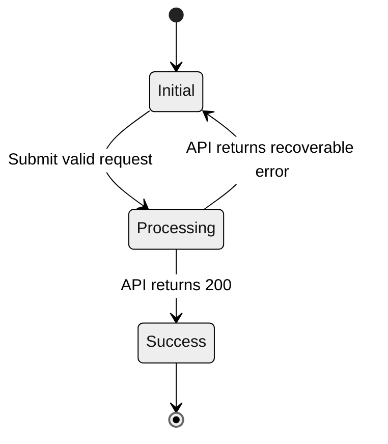
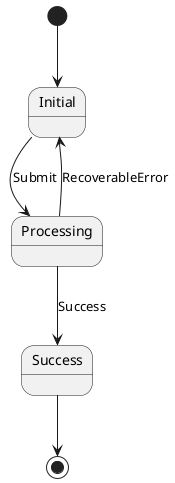

# Agent-Ready Spec Template

Use this template for daily product feature iterations that will be implemented by AI coding agents.

```markdown
# [Feature Name] Iteration Contract (Agent-Ready Spec)

## Agent Directives

- Treat this document as the single source of truth for the current task.
- Parse and follow every state machine, constraint, and contract before changing code.
- Do not implement behavior listed in `Out-of-Scope`.
- Do not invent undeclared APIs, data fields, permissions, UI states, routes, events, or background jobs.
- If required business logic is missing, stop and ask a blocking question.
- First produce an implementation plan that checks compatibility with the existing architecture. Write code only after the plan is approved when the workflow requires approval.

## 1. Context And Scope

### 1.1 Business And User Value

- Target users:
- Pain point:
- Desired business result:
- Success metric:

### 1.2 Scope Boundaries

In-Scope:

- 
- 

Out-of-Scope:

- 
- 

## 2. Technical And Non-Functional Constraints

- Frontend stack:
- Backend stack:
- Required libraries/components:
- Forbidden libraries/patterns:
- Authentication and authorization constraints:
- Observability/logging constraints:

Quantitative NFRs:

- API P95 latency:
- Client bundle size budget:
- Third-party timeout:
- Rate limit:
- Accessibility threshold:

## 3. Data Model And API Contracts

### 3.1 Entity Schema Changes

Target table/entity: `[name]`

| Field Name | Data Type | Constraints | Description |
| --- | --- | --- | --- |
| `[field]` | `[type]` | `[required/nullable/default/index/foreign key]` | `[business meaning]` |

### 3.2 API Specification

- Endpoint:
- Method:
- Auth:
- Idempotency:
- Rate limit:

Request payload:

```json
{
  "example_field": "string"
}
```

Response handling:

| Status | Response Contract | Required Client Behavior |
| --- | --- | --- |
| 200 OK |  |  |
| 400 Bad Request |  |  |
| 401 Unauthorized |  |  |
| 403 Forbidden |  |  |
| 409 Conflict |  |  |
| 422 Unprocessable Entity |  |  |
| 500 Server Error |  |  |

## 4. State Logic And Transitions

Use monochrome, style-free Mermaid. Do not add `style`, `classDef`, icons, colors, gradients, or custom CSS.



State transition matrix:

| Current State | Trigger/Condition | Target State | Required Side Effects | Illegal Variants |
| --- | --- | --- | --- | --- |
| Initial |  |  |  |  |
| Processing |  |  |  |  |

PlantUML, when needed:



## 5. Behavior-Driven Acceptance Criteria

Feature: `[feature behavior]`

### Scenario 1: `[happy path]`

Given:
When:
Then:
And:

### Scenario 2: `[edge case]`

Given:
When:
Then:
And:

### Scenario 3: `[failure or permission case]`

Given:
When:
Then:
And:

## 6. Verification Contract

Required tests:

- Unit:
- Integration/API:
- E2E:
- Contract/schema:
- Accessibility:

Manual verification:

- 
- 

Done means:

- All declared states are implemented.
- All illegal transitions are blocked.
- All API fields match the contract.
- All BDD scenarios are covered by tests or explicit manual checks.
- No out-of-scope behavior was introduced.
```
