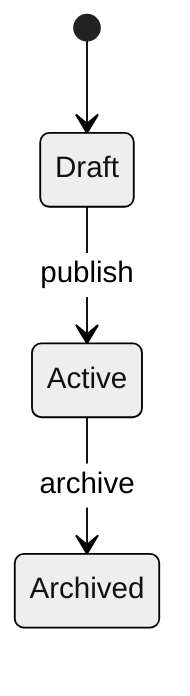
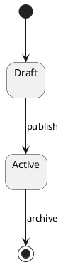

# AI Native Product Spec

## Purpose

Turn product intent into an executable contract for AI-assisted development. Optimize for structured constraints over narrative prose: clear scope, data/API contracts, state machines, non-goals, numeric NFRs, and acceptance tests.

Use `assets/agent-ready-spec-template.md` when the user wants a reusable Markdown spec file or when the request is broad enough to need a full contract.

## Core Workflow

1. Classify the work item:
   - Epic: strategic business outcome spanning multiple iterations.
   - Feature: independently valuable product capability, usually 1-2 sprints.
   - User Story: smallest user-value unit suitable for AI implementation context.
   - Task: technical implementation step; usually let the coding agent derive it from the spec.
2. Identify the right output:
   - Roadmap or portfolio decision: summarize Epic/Feature, success metrics, capacity allocation, and sequencing.
   - Daily implementation request: produce one Agent-Ready Spec per User Story or tightly scoped Feature slice.
   - Bugfix or UX debt: frame as behavior restoration or product-quality work with explicit reproduction, target behavior, and regression checks.
3. Prefer prototype-before-PRD when UI is material:
   - Ask for or infer the high-fidelity interaction reference before writing implementation details.
   - If only low-fidelity input exists, call out unknown UI states instead of letting the agent guess.
4. Write the spec as a contract:
   - Business value and target users.
   - In-scope and out-of-scope boundaries.
   - Data model and API contracts before behavior logic.
   - State transition matrix for lifecycle behavior.
   - BDD scenarios plus explicit negative and edge cases.
   - Tests and verification commands expected from the implementation agent.
5. Close ambiguity before coding:
   - If a missing API, field, state, auth rule, or UI state would force invention, ask a focused question or mark it as `NEEDS_DECISION`.

## Roadmap Capacity Rules

Use capacity buckets instead of forcing unlike work into a single priority score:

| Category | Default Capacity | Management Rule |
| --- | ---: | --- |
| New features | 60-70% | Tie to roadmap milestones, business outcomes, and user value. |
| UX and technical debt | 20-30% | Keep as protected sprint capacity or a dedicated refactor Epic. |
| Bugs | 10-15% | Use SLA/severity triage; if bug work exceeds 20%, pause feature expansion and stabilize. |

Tag work as `feature`, `ux-debt`, `tech-debt`, or `bug`. Do not hide design-system cleanup, interaction consistency, or component standardization as incidental chores; they are roadmap work when they reduce future delivery risk.

## Contract Requirements

Every implementation-ready spec should include:

- Agent directives: define the spec as the single source of truth and prohibit invented APIs, fields, states, libraries, and out-of-scope work.
- Context and scope: target user, pain, success metric, in-scope, out-of-scope.
- Technical constraints: frontend/backend stack, approved dependencies, auth, permissions, storage, telemetry, numeric NFRs.
- Data model: tables/entities, field types, nullability, uniqueness, relationships, migrations, backward compatibility.
- API contract: endpoint, auth, request payload, response shapes, status codes, idempotency, rate limits, error mapping.
- State logic: allowed states, allowed transitions, forbidden transitions, required side effects.
- Acceptance criteria: BDD scenarios for happy path, edge cases, errors, and regression risks.
- Verification: unit/integration/E2E targets and concrete commands when known.

## Diagram Rules

Use diagrams only to clarify logic. Keep them easy for LLMs to parse:

- Use Mermaid or PlantUML source in Markdown, not screenshots, for agent consumption.
- Keep diagrams monochrome and style-free.
- Do not add icons, custom colors, gradients, class definitions, or layout tricks.
- Focus on node names, events, guards, and side effects.

Mermaid header:

PlantUML header:

## Output Guidance

When drafting a spec:

- Use compact Markdown tables for schemas, APIs, states, and test matrices.
- Prefer exact values over adjectives: `P95 <= 200ms`, `max 50KB bundle increase`, `timeout 5000ms`.
- Include `Out-of-Scope` aggressively to prevent overbuilding.
- Put `NEEDS_DECISION` on unresolved product or architecture choices.
- Do not invent implementation details that contradict the existing codebase; instruct the agent to inspect local patterns first.
- Keep one spec focused enough for a coding agent to plan, implement, and verify in one coherent pass.

## Reusable Asset

Use or copy `assets/agent-ready-spec-template.md` for a full daily product iteration template.
