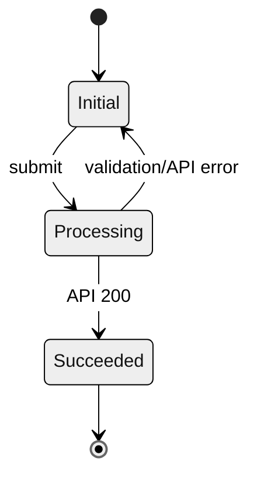

# [Feature Name] Agent-Ready Spec

## Agent Directives

- This document is the single source of truth for this change.
- Before writing code, inspect the existing codebase and produce an implementation plan that maps this contract to local patterns.
- Do not implement anything listed in `Out-of-Scope`.
- Do not invent undeclared APIs, data fields, entity states, UI states, libraries, permissions, or side effects.
- If a required contract is missing, stop and ask a focused question or mark `NEEDS_DECISION`.

## 1. Context And Scope

### 1.1 Business And User Value

| Field | Value |
| --- | --- |
| Target users | [Who is affected?] |
| User pain | [What friction or failure exists today?] |
| Business goal | [Metric or outcome this should move] |
| Success metric | [Numeric target, dashboard, or observable behavior] |

### 1.2 Scope Boundaries

In-Scope:

- [Required behavior or capability]
- [Required UI/API/data change]

Out-of-Scope:

- [Explicit non-goal to prevent overengineering]
- [Feature variant or adjacent workflow not included]

## 2. Technical And Non-Functional Constraints

| Constraint | Requirement |
| --- | --- |
| Frontend stack | [Framework, component library, state management] |
| Backend stack | [Runtime, framework, database, queue] |
| Auth and permissions | [Roles, guards, policies] |
| Approved dependencies | [Libraries allowed or forbidden] |
| Compatibility | [Migration/backward compatibility/browser/device constraints] |

Numeric NFRs:

- Latency: [e.g. API P95 <= 200ms]
- Reliability: [e.g. retry max 2, timeout 5000ms]
- Security: [e.g. no secrets in client logs, server-side authorization required]
- Performance budget: [e.g. frontend bundle increase <= 50KB]
- Rate/idempotency: [e.g. one idempotency_key per mutation, max 5 requests/min/user]

## 3. Data Model And API Contracts

### 3.1 Entity Updates

Target table/entity: `[name]`

| Field Name | Data Type | Constraints | Description |
| --- | --- | --- | --- |
| `[field]` | `[type]` | `[nullable/unique/default/index/fk]` | `[business meaning]` |

Migration requirements:

- [Backfill/default behavior]
- [Rollback consideration]
- [Data integrity invariant]

### 3.2 API Specification

Endpoint: `[METHOD /path]`

Auth: `[required role/session/token policy]`

Request payload:

```json
{
  "example_field": "string (Required, max length 255)",
  "idempotency_key": "string (Required, UUID v4)"
}
```

Response handling:

| Status | Response Shape | Required Client/Server Behavior |
| --- | --- | --- |
| 200 OK | `{ "status": "..." }` | [Success behavior] |
| 400 Bad Request | `{ "error": { "code": "...", "message": "..." } }` | [Validation behavior] |
| 401/403 | `{ "error": { "code": "..." } }` | [Auth behavior] |
| 409 Conflict | `{ "error": { "code": "..." } }` | [Idempotency or state conflict behavior] |
| 500 | `{ "error": { "code": "internal_error" } }` | [Fallback behavior] |

## 4. State Logic And Transitions



State transition matrix:

| Current State | Trigger/Condition | Target State | Required Side Effects | Forbidden Behavior |
| --- | --- | --- | --- | --- |
| `Initial` | `[event]` | `Processing` | `[disable controls, show loading]` | `[do not duplicate request]` |
| `Processing` | `[success]` | `Succeeded` | `[persist/update UI/emit event]` | `[do not remain loading]` |
| `Processing` | `[error]` | `Initial` | `[show localized error, restore controls]` | `[do not clear user input unless specified]` |

Forbidden transitions:

- `[State A] -> [State B]` is forbidden because `[reason]`.

## 5. UX Contract

| UI State | Required Behavior |
| --- | --- |
| Default | [Visible controls, labels, enabled states] |
| Loading | [Skeleton/spinner/disabled behavior] |
| Empty | [Empty copy/action] |
| Error | [Error placement, copy source, retry path] |
| Success | [Confirmation, navigation, persisted state] |

Accessibility and localization:

- [Keyboard behavior/focus management]
- [ARIA or semantic requirements]
- [Localization keys or copy constraints]

## 6. BDD Acceptance Criteria

Feature: `[feature behavior]`

Scenario 1: `[happy path]`

- Given `[precondition]`
- When `[user/system action]`
- Then `[observable result]`
- And `[side effect or persisted state]`

Scenario 2: `[error or edge case]`

- Given `[precondition]`
- When `[failure condition]`
- Then `[observable fallback]`
- And `[state machine recovery]`

Scenario 3: `[permission/regression case]`

- Given `[precondition]`
- When `[action]`
- Then `[result]`

## 7. Verification Plan

Required tests:

| Layer | Coverage |
| --- | --- |
| Unit | [Pure logic/state/API validation] |
| Integration | [Database/API/service contract] |
| E2E | [User workflow and visible UI states] |
| Regression | [Existing behavior that must not break] |

Commands, if known:

```bash
[project test command]
[project lint/build command]
```

Manual verification:

- [Step-by-step check]
- [Expected result]

## 8. Open Decisions

| Decision | Owner | Deadline | Default If Unresolved |
| --- | --- | --- | --- |
| `NEEDS_DECISION: [question]` | [PM/Eng/Design] | [date] | [block/assumption] |
